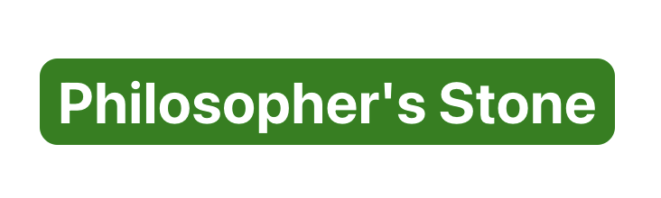

# Logo : 

# App Name : Philosopher's Stone

# Getting Started : Planning Material: https://miro.com/app/board/uXjVIeS6xEM=/ 
 # Planning Material : https://miro.com/app/board/uXjVIeSe8Sc=/

# Backend Repo : https://github.com/llewibyr/Comic-Kaze-Backend

# Attributions : https://miro.com/login/, trello.com 

# Technologies Used : Axios, Bcrypt, JavaScript, React, express, cors, jwt, dotenv

# Next Steps : Next steps include adding a delete function to inside the cart. Making the UI/UX more flashy. As well as, adding more books to database.
```
Comic-Kaze
├─ README.md
├─ image.png
├─ package-lock.json
├─ package.json
├─ public
│  ├─ favicon.ico
│  ├─ index.html
│  ├─ logo192.png
│  ├─ logo512.png
│  ├─ manifest.json
│  └─ robots.txt
└─ src
   ├─ App.css
   ├─ App.js
   ├─ components
   │  ├─ CartView.js
   │  ├─ Header.js
   │  ├─ PrivateRoute.js
   │  ├─ ProductItem.js
   │  └─ ProductList.js
   ├─ context
   │  ├─ AuthContext.js
   │  └─ ItemContext.js
   ├─ index.css
   ├─ index.js
   └─ pages
      ├─ Cart.js
      ├─ Login.js
      └─ Register.js

```